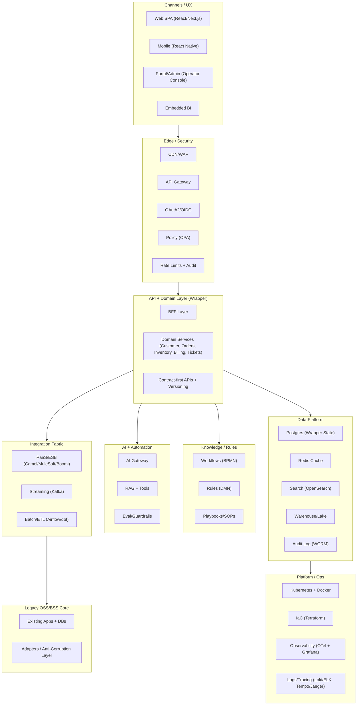

# Wrapper Modernization Blueprint (OSS/BSS)

## Goal
Deliver a “new iPhone shell” for legacy OSS/BSS: a modern UI, API, data, and automation layer that preserves native process, business rules, and institutional knowledge while leaving the legacy system of record intact.

---

## Diagram (Mermaid)

---

## Reference Architecture (Wrapper Modernization Tech Stack)

**Channels / UX**
- Web SPA: React / Next.js
- Mobile: React Native
- Portal/Admin: Role-based operator console, task-driven UX
- Embedded BI: dashboards and ad-hoc exploration
- Shared UX controls: SSO, RBAC, audit, feature flags

**Edge / Security**
- CDN/WAF: Cloudflare or Akamai
- API Gateway: Kong, Apigee, or NGINX
- OAuth2/OIDC: Keycloak, Okta, or Auth0
- Policy: OPA (Open Policy Agent)
- Rate limiting + abuse prevention

**API + Domain Layer (the “new wrapper”)**
- Backend-for-Frontend (BFF)
- Domain services (microservices or modular monolith):
  - Customer/CRM
  - Orders
  - Inventory
  - Provisioning
  - Billing/Rating
  - Payments
  - Trouble/Field
  - Network events
- Contract-first APIs (OpenAPI/GraphQL)
- Versioned APIs and event schemas

**Integration Fabric**
- iPaaS/ESB: MuleSoft, Boomi, Camel, or Kafka-based
- EDI/Batch/ETL: Airflow + dbt

**Knowledge / Rules**
- BPMN workflow engine: Camunda or Temporal
- Rules engine: Drools/DMN or rules microservice
- Versioned rules with effective dates + change history
- “Playbooks”: runbooks/SOPs for operator guidance

**AI + Automation**
- AI Gateway: model routing, redaction, guardrails
- RAG + tools: search, ticket actions, summarization
- Evaluation harness for quality and hallucination checks

**Legacy OSS/BSS Core**
- Existing apps, databases, scripts, report logic
- Adapter/anti-corruption layer (no direct coupling)

**Data Platform (operational + analytics)**
- Operational DBs: Postgres (wrapper state + config)
- Cache: Redis
- Search: OpenSearch/Elasticsearch
- Streaming: Kafka + event store patterns
- Warehouse/Lake: Snowflake/BigQuery + dbt
- Audit log: append-only, WORM-capable

**Platform / Ops**
- Containers: Docker + Kubernetes
- IaC: Terraform
- CI/CD: GitHub Actions or GitLab
- Observability: OpenTelemetry + Grafana
- Logs: Loki/ELK
- Tracing: Tempo/Jaeger
- Secrets: Vault

---

## What “Retaining Native Knowledge and Process” Means
You keep the legacy system as the system of record, but you extract and formalize knowledge into three portable assets:

1) **Process definitions (workflows, states, approvals)**
   - Modeled in BPMN / workflow engine (Camunda or Temporal)
   - Becomes the backbone for the operator experience

2) **Rules & decision logic (pricing rules, eligibility, audit validations)**
   - Encoded in DMN/rules engine (Drools/DMN or rules service)
   - Versioned with effective dates and change history
   - Auditable and reproducible

3) **Canonical data model + contracts**
   - Clean domain model mapped to legacy via adapters
   - Contract-first APIs (OpenAPI) and event schemas
   - Knowledge becomes portable, not locked inside screens or stored procedures

---

## Recommended Tooling (by Layer)

**UX / Operator Console**
- React + TypeScript
- Next.js for routing/SSR where needed
- Component system: Material UI or shadcn/ui
- State/data: TanStack Query + Zustand
- Feature flags: LaunchDarkly (or open-source)

**API & Services**
- Java + Spring Boot (domain services)
- TypeScript (BFF + integration-heavy services)
- API Gateway: Kong or Apigee
- Auth: Keycloak (self-hosted) or Okta/Auth0 (managed)

**Integration Fabric**
- Event streaming: Kafka
- Integration: Apache Camel (pragmatic) or MuleSoft/Boomi (enterprise)
- Batch/workflows: Airflow for ETL, Camunda/Temporal for business workflows
- Data transforms: dbt in the warehouse

**Data**
- Postgres (operational data)
- Redis (cache)
- OpenSearch/Elasticsearch (search)
- Snowflake/BigQuery (warehouse)
- WORM-capable audit logging

**Observability & Audit**
- OpenTelemetry (traces/metrics/logs)
- Prometheus + Grafana
- Central logs: ELK or Loki
- SIEM hooks: Splunk/Elastic Security (per org)

**AI Integration**
- AI Gateway provides:
  - PII redaction
  - prompt templates
  - retrieval (RAG) from approved sources
  - tool calling (ticket actions, summaries)
  - eval harness (quality + hallucination checks)
- Knowledge sources: SOPs/runbooks, policy docs, historical tickets
- Index in OpenSearch and/or a vector store

---

## High-ROI “Wrapper Modules” to Start With
These give the highest operator ROI while minimizing core ledger risk:

- **Order orchestration + fallout management**
- **Trouble ticketing + customer comms automation**
- **Inventory explorer** (service/location/resource)
- **Audit pack generator**
- **“Show me the history” timeline** (who/what/when/why)
- **Agent assist** (guided scripts, notes, call wrap-up)

---

## Core Tech Language Recommendation

**Default for OSS/BSS wrapper core**
- Java + Spring Boot (domain services, workflow integration, long-lived backends)
- TypeScript (BFF + UI + integration services)

**Alternative for Microsoft-heavy orgs**
- C# / .NET backend + TypeScript frontend

**Where Python fits**
- ETL, automation, analytics, AI orchestration utilities
- Not ideal as the primary transactional core for OSS/BSS domain services

---

## Minimum “New Features” That Actually Matter
- Operator timeline (single pane for customer/order/ticket/audit trail)
- Guided workflows (reduce training + variance)
- Search-first console (fast retrieval)
- AI assist for notes, next steps, comms drafts
- Audit pack generator (repeatable evidence + explainability)

---

## Practical Next Steps
1) Define the canonical domain model for 6–10 objects (Customer, Location, Service, Order, Invoice, Payment, Ticket, Device, Circuit, Grant/Audit Entity).
2) Build the adapter layer to legacy (read paths first, then writes).
3) Ship the first wrapper module: Order + Fallout or Ticket + Comms, plus the timeline.
4) Add workflow engine and migrate process knowledge out of screens/scripts.
5) Formalize rules and decisions into versioned, auditable assets.

---

## Optional Deliverables (Available on Request)
- One-page vendor-neutral modernization blueprint slide
- BEAD audit survivability mapping (end-to-end audit trail + rules versioning)
